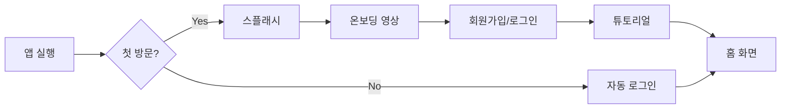

# Nobada UX 디자인 가이드

## 1. 사용자 경험 원칙

### 1.1 디자인 철학
- **영상 우선**: UI는 최소화, 영상이 주인공
- **원터치 인터랙션**: 복잡한 조작 없이 직관적
- **몰입형 경험**: 끊김 없는 영상-음성 동기화
- **감정적 연결**: 캐릭터와의 정서적 유대감 형성

### 1.2 핵심 가치
1. **Seamless**: 끊김 없는 경험
2. **Immersive**: 깊은 몰입감
3. **Personal**: 개인화된 스토리
4. **Emotional**: 감정적 공감

## 2. 사용자 플로우

### 2.1 온보딩 플로우



**온보딩 상세**
1. **스플래시 (1초)**
   - Nobada 로고 페이드인
   - 배경: 그라디언트 애니메이션

2. **온보딩 영상 (15초)**
   - 서비스 컨셉 소개
   - 주요 캐릭터 프리뷰
   - Skip 버튼 (3초 후 표시)

3. **회원가입/로그인**
   - 소셜 로그인 우선 (구글, 애플)
   - 이메일 가입은 보조 옵션

4. **튜토리얼 (선택적)**
   - 대화 방법 안내
   - 첫 하트 100개 지급
   - 샘플 대화 체험

### 2.2 홈 화면 플로우

```
┌─────────────────────────┐
│     홈 (피드형)          │
│ ┌─────────────────────┐ │
│ │                     │ │
│ │   [영상 썸네일]      │ │
│ │                     │ │
│ │  ♥ 호감도 Lv.3      │ │
│ │  "첫 만남"          │ │
│ └─────────────────────┘ │
│         ↑↓스와이프        │
│ ┌─────────────────────┐ │
│ │   [다음 에피소드]     │ │
│ └─────────────────────┘ │
└─────────────────────────┘
        │ 탭
        ↓
┌─────────────────────────┐
│    에피소드 상세         │
│ - 캐릭터 소개           │
│ - 예상 플레이 시간       │
│ - 난이도               │
│ [시작하기] 버튼          │
└─────────────────────────┘
```

### 2.3 채팅 플로우

```
사용자 입장 → 인트로 영상 재생
    ↓
채팅 화면 진입
    ↓
┌─────────────────────────┐
│  [캐릭터 영상]           │
│  + TTS 음성 재생        │
├─────────────────────────┤
│  AI: 안녕하세요!         │
│                        │
│  User: 안녕!           │
│                        │
│  AI: [영상+TTS 응답]    │
├─────────────────────────┤
│  [입력창] [전송]         │
└─────────────────────────┘
    ↓
관계도 변화 → 스토리 분기
    ↓
엔딩 도달 → 엔딩 영상
    ↓
결과 화면 (갤러리 해금 등)
```

## 3. UI 컴포넌트 디자인

### 3.1 컬러 팔레트

```scss
// Primary Colors
$nobada-pink: #FF6B9D;      // 메인 브랜드 컬러
$nobada-rose: #C44569;       // 보조 브랜드 컬러
$nobada-light: #FFC0CB;      // 라이트 핑크

// Emotion Colors
$emotion-love: #FF1744;      // 사랑/호감
$emotion-happy: #FFD54F;     // 기쁨
$emotion-sad: #7986CB;       // 슬픔
$emotion-angry: #FF5252;     // 화남
$emotion-shy: #FFB6C1;       // 수줍음

// System Colors
$background: #0A0A0A;        // 메인 배경 (순수 블랙)
$surface: #1A1A1A;           // 카드/버블 배경
$surface-elevated: #2D2D2D;  // 상승된 표면

// Text Colors
$text-primary: #FFFFFF;      // 주요 텍스트
$text-secondary: #B0B0B0;    // 보조 텍스트
$text-muted: #6B6B6B;        // 비활성 텍스트

// Status Colors
$success: #4CAF50;
$warning: #FFC107;
$error: #F44336;
$info: #2196F3;
```

### 3.2 타이포그래피

```scss
// Font Family
$font-primary: 'Pretendard', -apple-system, BlinkMacSystemFont, sans-serif;
$font-secondary: 'Inter', sans-serif;

// Font Sizes (rem)
$text-xs: 0.75rem;    // 12px
$text-sm: 0.875rem;   // 14px
$text-base: 1rem;     // 16px
$text-lg: 1.125rem;   // 18px
$text-xl: 1.25rem;    // 20px
$text-2xl: 1.5rem;    // 24px

// Font Weights
$font-light: 300;
$font-regular: 400;
$font-medium: 500;
$font-semibold: 600;
$font-bold: 700;

// Line Heights
$leading-tight: 1.25;
$leading-normal: 1.5;
$leading-relaxed: 1.75;
```

### 3.3 스페이싱 시스템

```scss
// Spacing Scale (px)
$space-0: 0;
$space-1: 4px;
$space-2: 8px;
$space-3: 12px;
$space-4: 16px;
$space-5: 20px;
$space-6: 24px;
$space-8: 32px;
$space-10: 40px;
$space-12: 48px;
$space-16: 64px;
```

## 4. 컴포넌트 명세

### 4.1 채팅 버블

```typescript
// AI 메시지 버블
interface AIMessageBubble {
  style: {
    background: 'linear-gradient(135deg, #FF6B9D 0%, #C44569 100%)',
    borderRadius: '20px 20px 20px 4px', // 왼쪽 하단 뾰족
    padding: '12px 16px',
    maxWidth: '85%',
    animation: 'slideInLeft 0.3s ease-out',
  };

  emotionIndicator?: {
    color: EmotionColor,
    icon: EmotionIcon,
    position: 'top-right',
  };
}

// 유저 메시지 버블
interface UserMessageBubble {
  style: {
    background: '#2D2D2D',
    borderRadius: '20px 20px 4px 20px', // 오른쪽 하단 뾰족
    padding: '12px 16px',
    maxWidth: '85%',
    animation: 'slideInRight 0.3s ease-out',
  };
}
```

### 4.2 영상 플레이어

```typescript
interface VideoPlayer {
  dimensions: {
    mobile: { width: '100%', aspectRatio: '9:16' },
    tablet: { width: '100%', aspectRatio: '16:9' },
    desktop: { maxWidth: '480px', aspectRatio: '9:16' },
  };

  controls: {
    showControls: false,        // 기본 컨트롤 숨김
    customControls: {
      fullscreen: true,         // 전체화면 버튼만
      position: 'top-right',
    },
  };

  transitions: {
    fadeIn: '0.5s ease-out',
    fadeOut: '0.3s ease-in',
    crossfade: '0.3s',         // 영상 전환 시
  };
}
```

### 4.3 입력창

```typescript
interface ChatInput {
  style: {
    background: '#1A1A1A',
    borderRadius: '24px',
    padding: '12px 20px',
    border: '1px solid #2D2D2D',
    focusBorder: '1px solid #FF6B9D',
  };

  features: {
    maxLength: 200,
    placeholder: '메시지를 입력하세요...',
    sendButton: {
      icon: 'paper-plane',
      activeColor: '#FF6B9D',
      inactiveColor: '#6B6B6B',
    },
  };

  animations: {
    typing: 'pulse 1.5s infinite',
    send: 'fly-out 0.3s ease-out',
  };
}
```

## 5. 애니메이션 가이드

### 5.1 마이크로 인터랙션

```css
/* 메시지 등장 */
@keyframes message-appear {
  0% {
    opacity: 0;
    transform: translateY(20px) scale(0.9);
  }
  100% {
    opacity: 1;
    transform: translateY(0) scale(1);
  }
}

/* 하트 애니메이션 (호감도 상승) */
@keyframes heart-burst {
  0% {
    transform: scale(0);
    opacity: 1;
  }
  50% {
    transform: scale(1.2);
  }
  100% {
    transform: scale(1) translateY(-100px);
    opacity: 0;
  }
}

/* 타이핑 인디케이터 */
@keyframes typing-dot {
  0%, 60%, 100% {
    transform: translateY(0);
    opacity: 0.7;
  }
  30% {
    transform: translateY(-10px);
    opacity: 1;
  }
}

/* 영상 전환 */
@keyframes video-transition {
  0% {
    filter: blur(10px);
    opacity: 0;
  }
  100% {
    filter: blur(0);
    opacity: 1;
  }
}
```

### 5.2 페이지 전환

```typescript
const pageTransitions = {
  // 슬라이드 전환
  slide: {
    initial: { x: '100%' },
    animate: { x: 0 },
    exit: { x: '-100%' },
    transition: { duration: 0.3, ease: 'easeInOut' },
  },

  // 페이드 전환
  fade: {
    initial: { opacity: 0 },
    animate: { opacity: 1 },
    exit: { opacity: 0 },
    transition: { duration: 0.2 },
  },

  // 스케일 전환 (모달)
  scale: {
    initial: { scale: 0.9, opacity: 0 },
    animate: { scale: 1, opacity: 1 },
    exit: { scale: 0.9, opacity: 0 },
    transition: { duration: 0.2, ease: 'easeOut' },
  },
};
```

## 6. 반응형 디자인

### 6.1 브레이크포인트

```scss
// Breakpoints
$mobile: 320px;     // iPhone SE
$mobile-lg: 430px;  // iPhone Pro Max
$tablet: 768px;     // iPad
$desktop: 1024px;   // Desktop
$desktop-lg: 1440px; // Large Desktop

// Media Queries
@mixin mobile {
  @media (max-width: #{$tablet - 1px}) {
    @content;
  }
}

@mixin tablet {
  @media (min-width: #{$tablet}) and (max-width: #{$desktop - 1px}) {
    @content;
  }
}

@mixin desktop {
  @media (min-width: #{$desktop}) {
    @content;
  }
}
```

### 6.2 레이아웃 전략

```typescript
// 모바일 우선 설계
const ResponsiveLayout = {
  // 모바일 (기본)
  mobile: {
    container: '100vw',
    padding: '16px',
    chatWidth: '100%',
    videoHeight: '40vh',
  },

  // 태블릿
  tablet: {
    container: '100vw',
    padding: '24px',
    chatWidth: '100%',
    videoHeight: '50vh',
  },

  // 데스크톱
  desktop: {
    container: 'min(100vw, 1440px)',
    padding: '32px',
    chatWidth: 'min(600px, 100%)',
    videoHeight: '60vh',
    layout: 'split-screen', // 영상 좌측, 채팅 우측
  },
};
```

## 7. 접근성 (A11y)

### 7.1 기본 요구사항

```html
<!-- ARIA 레이블 -->
<button aria-label="메시지 전송" aria-pressed="false">
  <SendIcon />
</button>

<!-- 포커스 관리 -->
<div role="dialog" aria-modal="true" aria-labelledby="modal-title">
  <!-- 모달 내용 -->
</div>

<!-- 라이브 리전 (채팅) -->
<div role="log" aria-live="polite" aria-label="대화 내용">
  <!-- 메시지들 -->
</div>
```

### 7.2 키보드 네비게이션

```typescript
const keyboardShortcuts = {
  'Enter': 'Send message',
  'Escape': 'Close modal/Exit fullscreen',
  'Space': 'Play/Pause video',
  'Tab': 'Navigate to next element',
  'Shift+Tab': 'Navigate to previous element',
  '/': 'Focus search/input',
};
```

## 8. 성능 최적화 UI

### 8.1 로딩 상태

```typescript
// 스켈레톤 로딩
const MessageSkeleton = () => (
  <div className="animate-pulse">
    <div className="bg-gray-700 rounded-lg h-12 w-3/4 mb-2" />
    <div className="bg-gray-700 rounded-lg h-8 w-1/2" />
  </div>
);

// 프로그레시브 로딩
const ProgressiveImage = ({ src, placeholder }) => {
  const [currentSrc, setCurrentSrc] = useState(placeholder);

  useEffect(() => {
    const img = new Image();
    img.src = src;
    img.onload = () => setCurrentSrc(src);
  }, [src]);

  return ;
};
```

### 8.2 최적화 전략

```typescript
// 1. 가상 스크롤 (긴 대화 목록)
import { VirtualList } from '@tanstack/react-virtual';

// 2. 이미지 최적화
const optimizedImageUrl = (url: string, width: number) => {
  return `${CDN_URL}/optimize?url=${url}&w=${width}&q=85&format=webp`;
};

// 3. 컴포넌트 레이지 로딩
const ChatScreen = lazy(() => import('./ChatScreen'));

// 4. 디바운싱 (입력)
const debouncedInput = useMemo(
  () => debounce(handleInput, 300),
  [handleInput]
);
```

## 9. 다크모드 (기본)

### 9.1 다크 테마 설정

```scss
// 다크모드 전용 (라이트 모드 없음)
:root {
  --bg-primary: #0A0A0A;
  --bg-secondary: #1A1A1A;
  --bg-elevated: #2D2D2D;

  --text-primary: #FFFFFF;
  --text-secondary: #B0B0B0;
  --text-muted: #6B6B6B;

  --border: #2D2D2D;
  --border-focus: #FF6B9D;

  // 그림자 (다크모드용)
  --shadow-sm: 0 2px 4px rgba(0, 0, 0, 0.5);
  --shadow-md: 0 4px 8px rgba(0, 0, 0, 0.6);
  --shadow-lg: 0 8px 16px rgba(0, 0, 0, 0.7);

  // 글로우 효과
  --glow-pink: 0 0 20px rgba(255, 107, 157, 0.5);
  --glow-love: 0 0 30px rgba(255, 23, 68, 0.6);
}
```

## 10. 플랫폼별 고려사항

### 10.1 iOS 최적화

```css
/* Safe Area 대응 */
.container {
  padding-top: env(safe-area-inset-top);
  padding-bottom: env(safe-area-inset-bottom);
}

/* iOS 바운스 비활성화 */
body {
  overscroll-behavior: none;
  -webkit-overflow-scrolling: touch;
}

/* iOS 비디오 인라인 재생 */
video {
  playsinline: true;
  webkit-playsinline: true;
}
```

### 10.2 Android 최적화

```typescript
// Android 뒤로가기 버튼 처리
useEffect(() => {
  const handleBackButton = (e: PopStateEvent) => {
    if (isModalOpen) {
      closeModal();
      e.preventDefault();
    }
  };

  window.addEventListener('popstate', handleBackButton);
  return () => window.removeEventListener('popstate', handleBackButton);
}, [isModalOpen]);
```

## 11. 에러 상태 디자인

### 11.1 에러 메시지

```typescript
const ErrorStates = {
  network: {
    icon: '📡',
    title: '연결할 수 없어요',
    message: '네트워크 상태를 확인해주세요',
    action: '다시 시도',
  },

  tts: {
    icon: '🔇',
    title: '음성을 재생할 수 없어요',
    message: '잠시 후 다시 시도해주세요',
    action: '무음으로 계속',
  },

  video: {
    icon: '🎬',
    title: '영상을 불러올 수 없어요',
    message: '다른 영상으로 대체됩니다',
    action: '확인',
  },

  payment: {
    icon: '💳',
    title: '결제에 실패했어요',
    message: '결제 정보를 확인해주세요',
    action: '다시 시도',
  },
};
```

## 12. 모션 디자인 원칙

### 12.1 애니메이션 가이드라인

```typescript
const animationPrinciples = {
  // 타이밍
  timing: {
    instant: 0,          // 즉시
    fast: 200,          // 빠른 전환
    normal: 300,        // 일반 전환
    slow: 500,          // 느린 전환
    verySlow: 1000,     // 매우 느린 전환
  },

  // 이징
  easing: {
    linear: 'linear',
    easeIn: 'cubic-bezier(0.4, 0, 1, 1)',
    easeOut: 'cubic-bezier(0, 0, 0.2, 1)',
    easeInOut: 'cubic-bezier(0.4, 0, 0.2, 1)',
    bounce: 'cubic-bezier(0.68, -0.55, 0.265, 1.55)',
  },

  // 용도별 애니메이션
  usage: {
    entering: { duration: 300, easing: 'easeOut' },
    exiting: { duration: 200, easing: 'easeIn' },
    morphing: { duration: 300, easing: 'easeInOut' },
    emphasis: { duration: 500, easing: 'bounce' },
  },
};
```

## 13. 제스처 인터랙션

### 13.1 터치 제스처

```typescript
const gestures = {
  // 스와이프
  swipe: {
    vertical: {
      up: 'Next episode',
      down: 'Previous episode',
    },
    horizontal: {
      left: 'Show options',
      right: 'Go back',
    },
  },

  // 핀치
  pinch: {
    in: 'Exit fullscreen',
    out: 'Enter fullscreen',
  },

  // 탭
  tap: {
    single: 'Select/Play',
    double: 'Like',
    long: 'Show context menu',
  },
};
```

## 14. 피드백 시스템

### 14.1 사용자 피드백

```typescript
// 햅틱 피드백 (모바일)
const hapticFeedback = {
  light: () => navigator.vibrate?.(10),
  medium: () => navigator.vibrate?.(20),
  heavy: () => navigator.vibrate?.(30),

  success: () => navigator.vibrate?.([10, 50, 10]),
  warning: () => navigator.vibrate?.([20, 100, 20]),
  error: () => navigator.vibrate?.([30, 200, 30]),
};

// 시각적 피드백
const visualFeedback = {
  success: {
    color: '#4CAF50',
    icon: '✓',
    animation: 'bounce',
  },
  error: {
    color: '#F44336',
    icon: '✕',
    animation: 'shake',
  },
  loading: {
    color: '#FF6B9D',
    icon: '◐',
    animation: 'spin',
  },
};
```

이 UX 디자인 가이드는 Nobada 서비스의 일관된 사용자 경험을 제공하기 위한 완전한 설계 지침입니다.